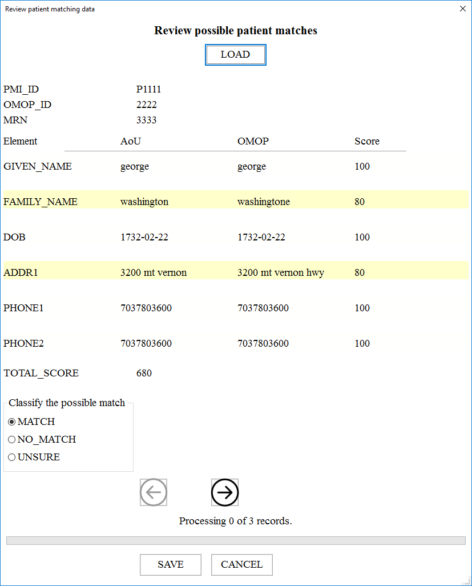

# Patient Match Reviewer
This app allows a user to quickly review a "Wobbler" file that shows potential matches betwen patients in two different databases.

The app:
* compares each data element's value and score
* highlights those elements that don't match
* allows the user to classify the pair of patients as: Match/No match/Unsure
* quickly move to the next record or back up for further review
* save a written copy to a .txt file.

## Use
To install:

    pip install git+https://github.com/DBMI/PatientMatchReviewer.git
    

To invoke from command line:

    import patientmatchreviewer
    review_manual_matches --file <filename>
    
 
For support, contact Kevin J. Delaney (kjdelaney@health.ucsd.edu)